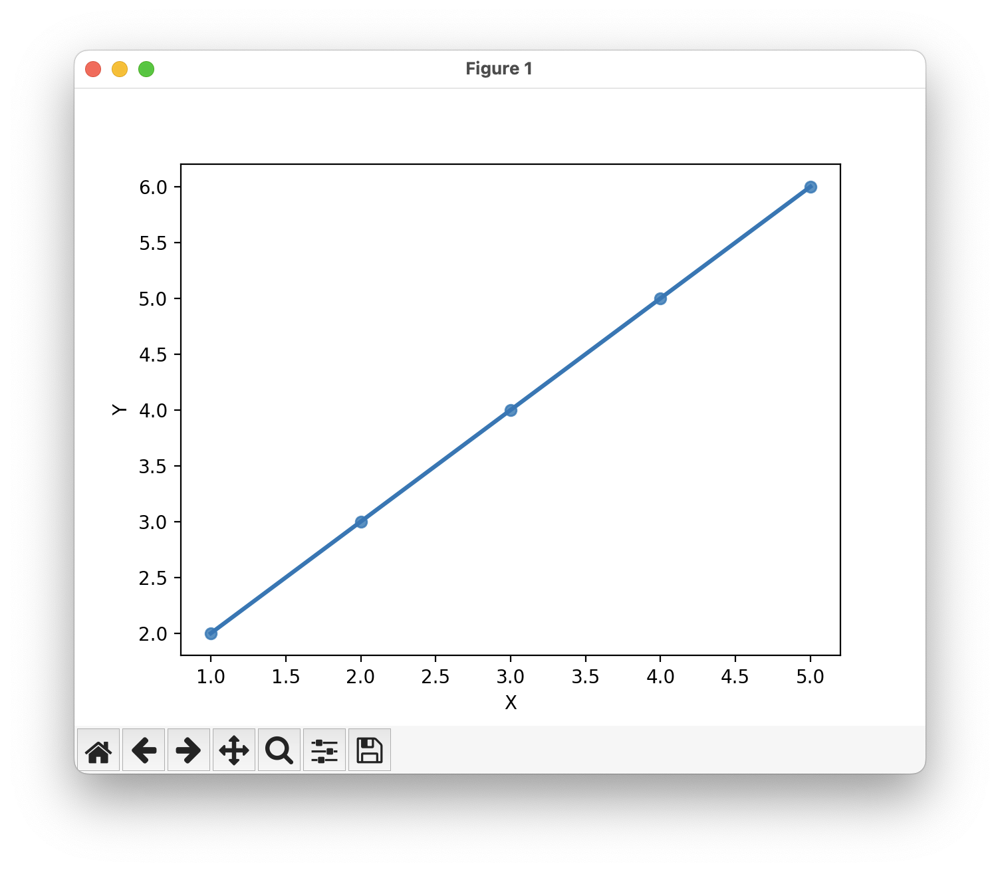

# linear-regression

Simple linear regressions for in memory array.

## Result



```text
Coefficient: 1.0
Intercept: 1.0
X = 1, Predicted Y = 2.0
X = 2, Predicted Y = 3.0
X = 3, Predicted Y = 4.0
X = 4, Predicted Y = 5.0
X = 5, Predicted Y = 6.0
Predicted Y for new value 8: [9.]
```