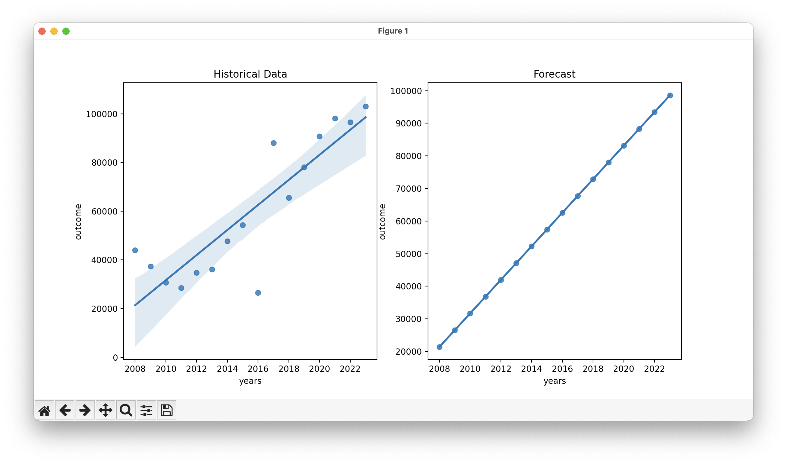

# forecast-expenditures

Given an historical collection of expenditures, and a year in the future; forecast the future expenditure amount for that year.

## Input

A collection of expenditure in CZK.

## Output

A single value with the forecasted expenditure amount in CZK and EUR.

## Result



```text
Predicted outcome for year 2024: [103729.2195] CZK or [4184.22252261] EUR
Predicted outcome per month is [8644.101625] CZK or [348.68521022] EUR
Predicted using the trained model:
    years       outcome
0    2008  21388.479265
1    2009  26534.775529
2    2010  31681.071794
3    2011  36827.368059
4    2012  41973.664324
5    2013  47119.960588
6    2014  52266.256853
7    2015  57412.553118
8    2016  62558.849382
9    2017  67705.145647
10   2018  72851.441912
11   2019  77997.738176
12   2020  83144.034441
13   2021  88290.330706
14   2022  93436.626971
15   2023  98582.923235
```
