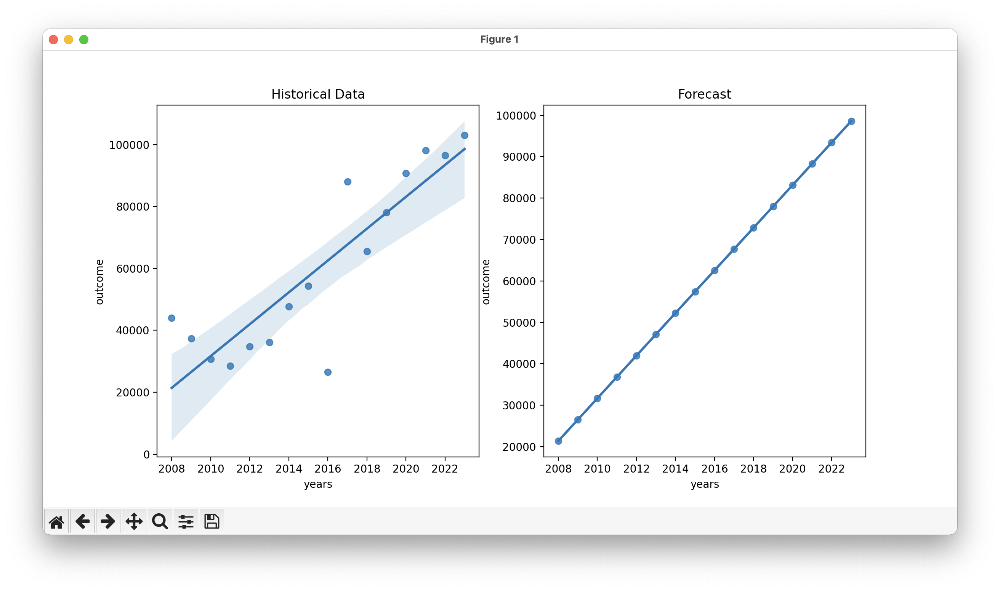

# forecast-expenditures

Given an historical collection of expenditures, and a year in the future; forecast the future expenditure amount for that year.

## Input

A collection of expenditure in CZK.

## Output

A single value with the forecasted expenditure amount in CZK.

## Result

