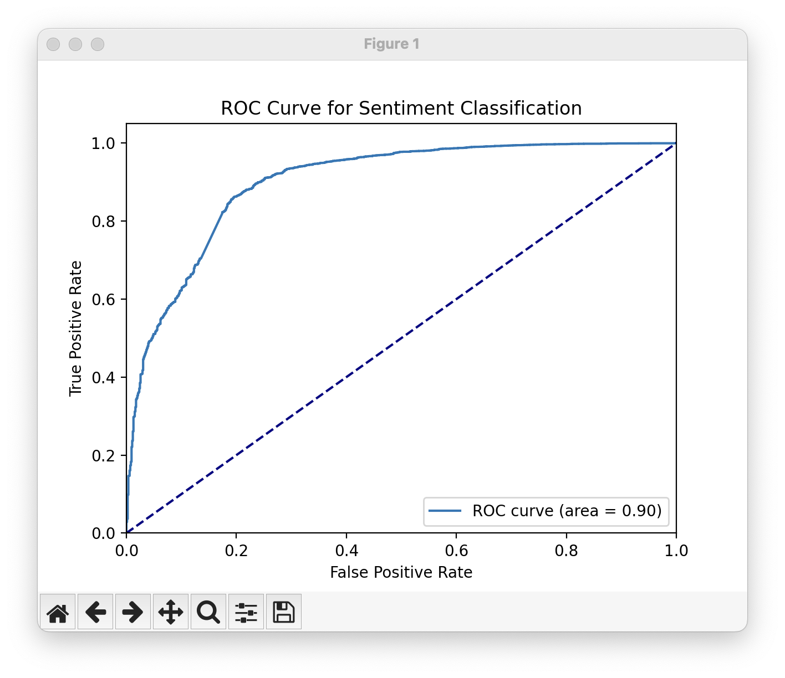

# sentiment-analysis-games

Given reviews for GTA games, classify each review as positive or negative.

## Input

A list of reviews per GTA game, along with generic information about the user such as the number of reviews and the last time they played games.

[Source data](https://www.kaggle.com/datasets/noahx1/grand-theft-auto-v)

## Output

A list of reviews along with their classification, which could be binary positive or negative sentiment, were the `true_sentiment` reppresent if the user upvoted and `predicted_sentiment` reppresents the result of the forecast.

## Result



```text
[ True  True  True False False]
Model evaluation:
  Accuracy: 0.9149
  Precision: 0.9268
  Recall: 0.9800
  F1-score: 0.9526
              precision    recall  f1-score   support

       False       0.77      0.47      0.58       855
        True       0.93      0.98      0.95      5891

    accuracy                           0.91      6746
   macro avg       0.85      0.72      0.77      6746
weighted avg       0.91      0.91      0.91      6746
```
