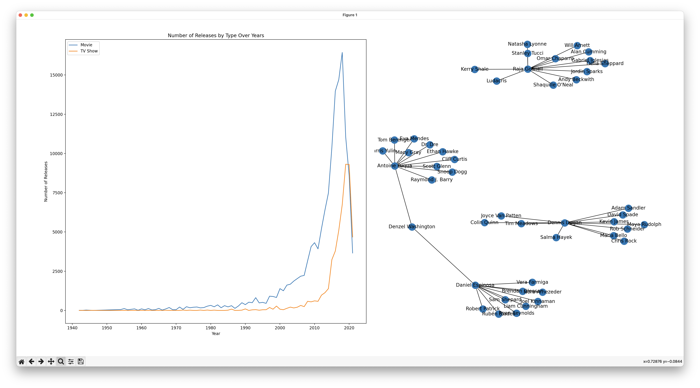

# data-analysis-movies

## Input

A list of movie information from Netflix.

[Source data](https://www.kaggle.com/datasets/shivamb/netflix-shows)

## Output

Analyze the data and answer the following questions:

- Understand what content is available in different countries.
- Identify similar content by matching text-based features (basically given a title, show me all other titles in the same category).
- Does Netflix have more focus on TV Shows than movies in recent years?
- Perform network analysis of actors/directors and find interesting insights.

## Notes

- The network diagram takes ages to plot with the full dataset, so only a subset of the data is used [0:2000].

## Results



Samples:

```text
------ List all categories in all country
['Documentaries' 'International TV Shows' 'TV Dramas' ... 'TV Mysteries'
 'Romantic TV Shows' 'TV Comedies' 'Dramas' 'Independent Movies'
 'International Movies' 'British TV Shows' 'Reality TV' 'Comedies'
 'Crime TV Shows' 'Spanish-Language TV Shows' 'TV Action & Adventure'
 'Romantic Movies' 'Docuseries' 'Horror Movies' 'Sci-Fi & Fantasy'
 'Thrillers' "Kids' TV" 'Action & Adventure' 'TV Sci-Fi & Fantasy'
 'Classic Movies' 'Anime Features' 'Anime Series'
 'Children & Family Movies' 'Music & Musicals' 'Sports Movies'
 'Korean TV Shows' 'Teen TV Shows' 'Cult Movies' 'Faith & Spirituality'
 'LGBTQ Movies' 'TV Horror' 'Stand-Up Comedy' 'TV Shows' 'Movies'
 'Classic & Cult TV' 'Science & Nature TV' 'TV Thrillers'
 'Stand-Up Comedy & Talk Shows']

------ List all titles in all country
['Dick Johnson Is Dead' 'Blood & Water' 'Kota Factory' ... 'Zombieland'
 'Zoom' 'Zubaan']

------ List all titles by country
"Canada, Japan, United States": [
        "Pup Star: World Tour"
    ],
    "United Kingdom, Canada, United States, Germany": [
        "Anon"
    ],
    "Italy, Switzerland, Albania, Poland": [
        "Forgive Us Our Debts"
    ],
    "United States, Japan, Canada": [
        "Kong: King of the Apes",
        "Pac-Man and the Ghostly Adventures"
    ],
    "Cambodia": [
        "Jailbreak"
    ],
    "Italy, United States, Argentina": [
        "Coffee for All"
    ],
    "Saudi Arabia, Syria, Egypt, Lebanon, Kuwait": [
        "Black Crows"
    ],
    "United States, Canada, Indonesia, United Kingdom, China, Singapore": [
        "Beyond Skyline"
    ],
    "Spain, Colombia": [
        "Orbiter 9"
    ],
    "United Kingdom, South Africa, Australia, United States": [
        "Troy"
    ],
    ...
```