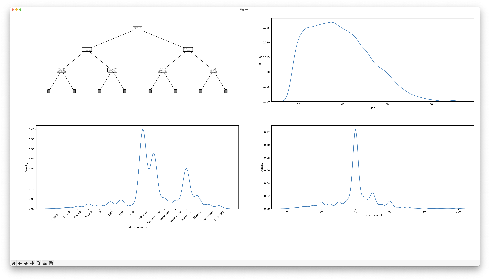

# data-analysis-movies

## Input

A list of salaries.

[Source data](https://www.kaggle.com/datasets/aemyjutt/salary-binary-classifier)

## Output

- Analyse frequency in the data
- Predict label salary using other features


## Results



Samples:

```
Accuracy: 0.8108398587440504
Predicted salary 1: <=50K
Predicted salary 2: >50K
```