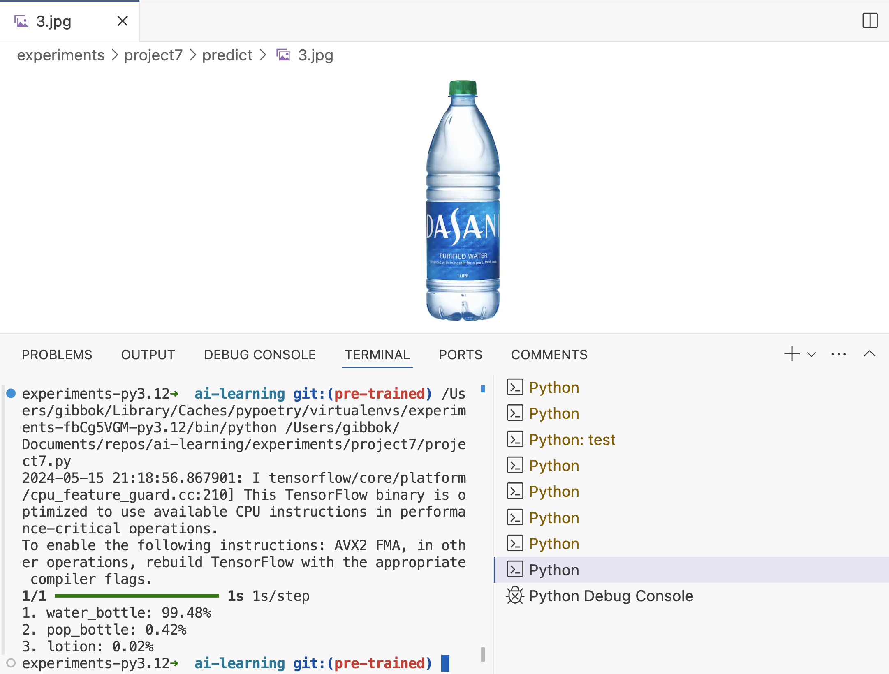

# image-classification 

## Input

Image classification using pre-trained ResNet50 model trained on ImageNet data.

## Output

- Top 3 predicted classes


## Results



Samples:

```
1. water_bottle: 99.48%
2. pop_bottle: 0.42%
3. lotion: 0.02%
```